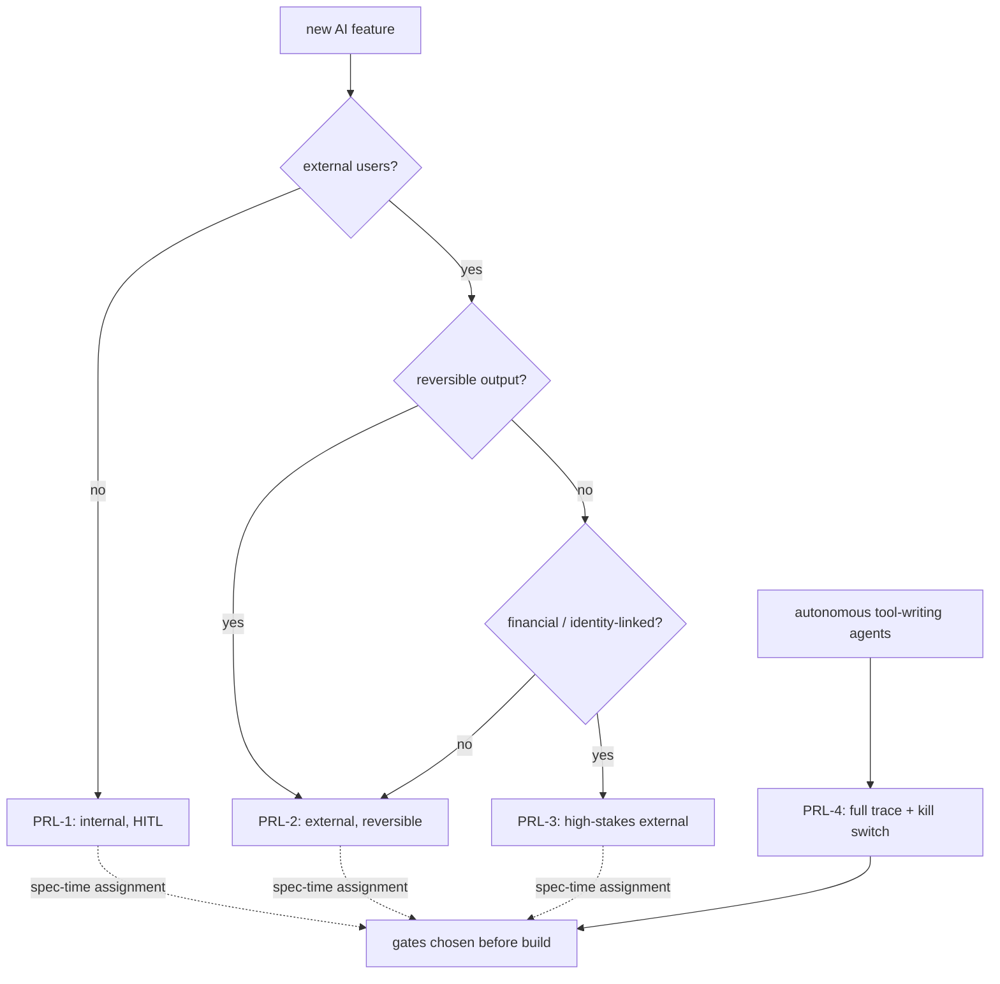

# Inside Anthropic with Dario Amodei #1: The Responsible Scaling Policy

*A five-part series tracing Anthropic's public thinking through Dario Amodei's writing and the company's model spec. One foundational document per entry, each with FRE|Nxt Labs live commentary on how we apply it in production AI work.*

---

## The document

> "We will not train or deploy models unless we have implemented safety and security measures that keep risks below acceptable levels."
>
> "Risk governance in this rapidly evolving domain should be **proportional, iterative, and exportable**."
>
> [**Anthropic's Responsible Scaling Policy v1.0**](https://www-cdn.anthropic.com/1adf000c8f675958c2ee23805d91aaade1cd4613/responsible-scaling-policy.pdf), published 19 September 2023

The RSP introduced **AI Safety Levels (ASL)**: graduated tiers of required safeguards that escalate as model capabilities escalate. ASL-2 governs today's frontier models; ASL-3, ASL-4, and beyond define what Anthropic commits to build *before* training models that could plausibly cause catastrophic harm.

---

## What we heard

The RSP's contribution is not the rules themselves. It is the framing. Three words do most of the work:

- **Proportional**: safeguards scale with capability. Don't over-engineer for GPT-3-era risks on a GPT-3-era model; don't under-engineer for frontier risks on a frontier model.
- **Iterative**: update the policy as capability grows. The v3.0 document is a direct descendant of v1.0, and the mechanism to update it is baked into the policy itself.
- **Exportable**: written as a prototype other companies can adopt. The RSP is deliberately structured so regulators and competitors can copy the pattern.

This is an operating procedure, not a press release. That distinction matters: every production AI team should have one.

---

## What we actually do with this

We adapted the RSP frame into what we call a **deployment-level matrix** for every client engagement. Instead of AI Safety Levels, we define **Production Risk Levels (PRL)**: four tiers based on blast radius.

| Tier | Description | Example | Required safeguards |
|---|---|---|---|
| **PRL-1** | Internal-only, human-in-the-loop, low stakes | Dev tools, internal dashboards | Logging, manual approval on outputs |
| **PRL-2** | External, non-financial, reversible | Content suggestions, draft assistants | + eval harness, content filters, rate limits |
| **PRL-3** | External, financial or identity-linked | Candidate evaluations, lead qualification | + human review of sampled outputs, adversarial testing, cost guardrails |
| **PRL-4** | Autonomous agents with tool access | Multi-agent systems with writes | + full trace replay, kill switches, incident response runbook |

Every AI feature we ship is assigned a PRL at spec time. The safeguards required at each tier are non-negotiable. You do not get to skip them because the deadline is tight. That is the RSP's "proportional" principle, applied to production systems instead of frontier model training.

## The PRL decision, at spec time

The tier is picked before the first line of the feature is written. That is the whole point of the "proportional, iterative, exportable" frame: you commit to the gates first, the product second.

---

## Applied: InterviewLM's PRL-3 gates

InterviewLM is a PRL-3 system (external, identity-linked via candidate assessments). The RSP-derived gates we shipped before going live:

- **Adversarial eval set**: 40+ prompt-injection and jailbreak attempts that must all return safe outputs before deployment
- **Human sampling review**: 5% of production sessions sampled weekly by an engineering lead
- **Cost guardrails**: hard-cap at $3.00 per session. No soft-alert, just termination.
- **Kill switch**: single-config toggle to disable all LLM calls without redeploying
- **Trace replay**: every session is reproducible from LangSmith traces

All five gates existed before we shipped. None were bolted on after an incident.

---

## The one thing to steal from this

Before your next AI feature ships, write a one-page Production Risk Level for it. Assign the tier. List the required safeguards. Get sign-off on the list, not the product, the safeguards. The RSP's real innovation is that it separates "what we are building" from "what we are committing to have in place before we ship it." Do the same.

---

## Next in this series

**#2. Claude's Constitution.** The "brilliant friend" framing that defines what Claude should actually be, and how we use it to audit every AI advisor product we ship.
