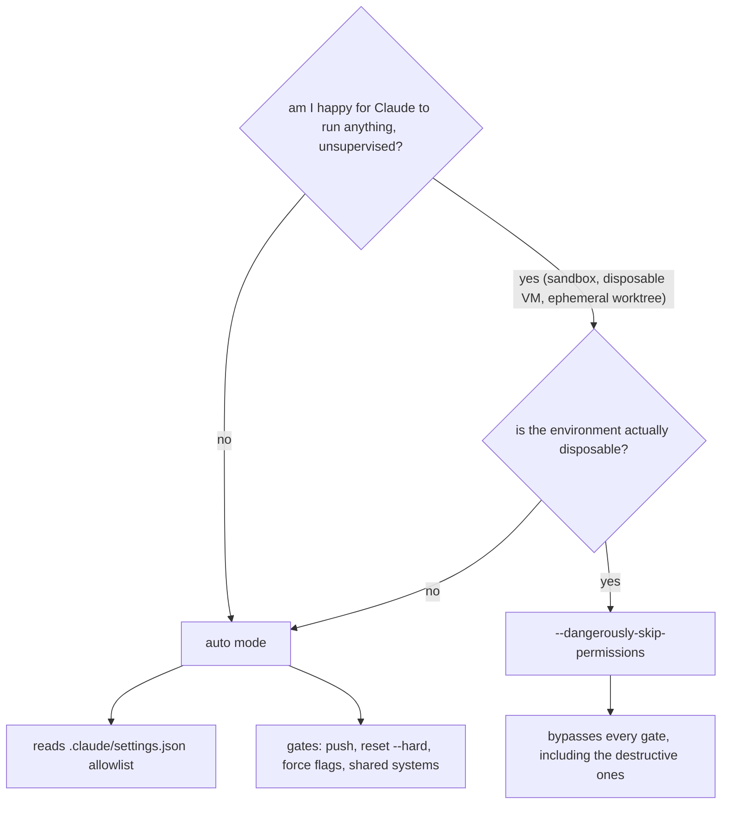

# Use auto mode, not `--dangerously-skip-permissions`

Two flags promise to stop Claude Code from pausing at every tool call. One of them reads your settings, honours your allowlist, and refuses to run anything genuinely destructive without asking. The other bypasses all of that. It is tempting to treat them as interchangeable because the surface behaviour looks the same: fewer interruptions, faster runs. Treating them as interchangeable is a mistake we would rather you learn from our logs than your own.

<WarStory title="One flag, one bricked branch">
A teammate ran a long refactor overnight with `--dangerously-skip-permissions` set. In the morning the branch would not check out: something in the flow had decided to `git reset --hard` over uncommitted scratch work, then force-pushed a cleanup commit on top. We recovered from a reflog, but the lesson was clearer than the recovery. We had given the tool permission to do anything, and it did. The same session under auto mode would have paused before the reset and the force-push. Not slower. Just correctly gated at the two steps that mattered.
</WarStory>

## The difference in one sentence

Auto mode skips the confirmation prompts for actions your settings already declared safe. `--dangerously-skip-permissions` skips every confirmation prompt for every action, including the ones no sane settings file would ever allow.

## The decision

The useful split is not "fast vs safe". It is "does this environment survive a bad decision". If the answer is no (your laptop, your repo, your credentials), the answer is auto mode. If the answer is genuinely yes (a sandboxed container you will throw away in an hour), `--dangerously-skip-permissions` has a narrow legitimate role.

## Why auto mode is the right default

Auto mode is the flag that understands your `.claude/settings.json`. Everything you marked `allow` runs silently. Everything in the destructive-by-default set (`git push --force`, `rm -rf`, `git reset --hard`, deploy scripts, anything that affects a shared system) still pauses. You get the speed of no-prompting on the ninety per cent of actions that are read-only or reversible, and you keep the human gate on the ten per cent that can actually hurt you.

Two properties matter:

- **Your allowlist is honoured.** If you declared `Bash(pnpm lint)` safe in `settings.json`, auto mode respects that. If you did not, it asks. The file stays the source of truth.
- **Destructive actions still gate.** Claude Code's default deny list survives auto mode. `--dangerously-skip-permissions` removes it.

The second point is the one that matters overnight, during long runs, or any time you stop watching the screen.

## Why `--dangerously-skip-permissions` is rarely the right answer

The flag's name is telling you. It is intended for environments where the blast radius of an unexpected action is zero: a disposable Docker container, an ephemeral CI runner, a throwaway worktree with no secrets. In those contexts it has a role.

Your laptop is not that environment. A repo with uncommitted scratch work is not that environment. A worktree on a branch somebody else has pushed to is not that environment. If the thing Claude Code is about to touch has any connection to your identity, your credentials, or your team's work, the flag is wrong by default.

We have seen three failure patterns repeatedly:

1. **Force-push on a shared branch.** A cleanup step decides history should be tidy. Nobody is asked. A teammate's commit is silently rewritten out of existence.
2. **`git reset --hard` over scratch work.** The model interprets "clean up the workspace" more literally than you meant. Uncommitted work is gone, and recovery depends on how recently the editor touched the file.
3. **Destructive cascade during long refactors.** A recoverable mistake at step three becomes an irrecoverable one at step eleven, because every step in between also ran without a prompt.

Each of these would have paused under auto mode. Each of them did not under `--dangerously-skip-permissions`.

## What we do

- **Auto mode is the default.** We run it in every session where the environment is not explicitly disposable.
- **The allowlist does the work.** Every reflexively-approved command (`pnpm lint`, `pnpm typecheck`, `git diff`, `git status`, `git log`) lives in `settings.json`. The friction that remains is friction that has a reason.
- **`--dangerously-skip-permissions` is scoped to sandboxes.** Ephemeral containers, disposable CI runs, a fresh worktree we are going to delete in an hour. Not the laptop. Not the repo. Not overnight.
- **If you need the flag and are not sure, you do not need the flag.** The question "is this environment disposable?" has a clear answer when it applies. Any time you find yourself arguing yourself into it, the answer is auto mode.

## The one thing to take from this

Pick the flag that respects your settings, not the flag that ignores them. Auto mode is the one that treats your `.claude/settings.json` as the source of truth and keeps a human gate on the actions that can ruin your week. `--dangerously-skip-permissions` is a power tool for a narrow context. Use it there. Not here.
