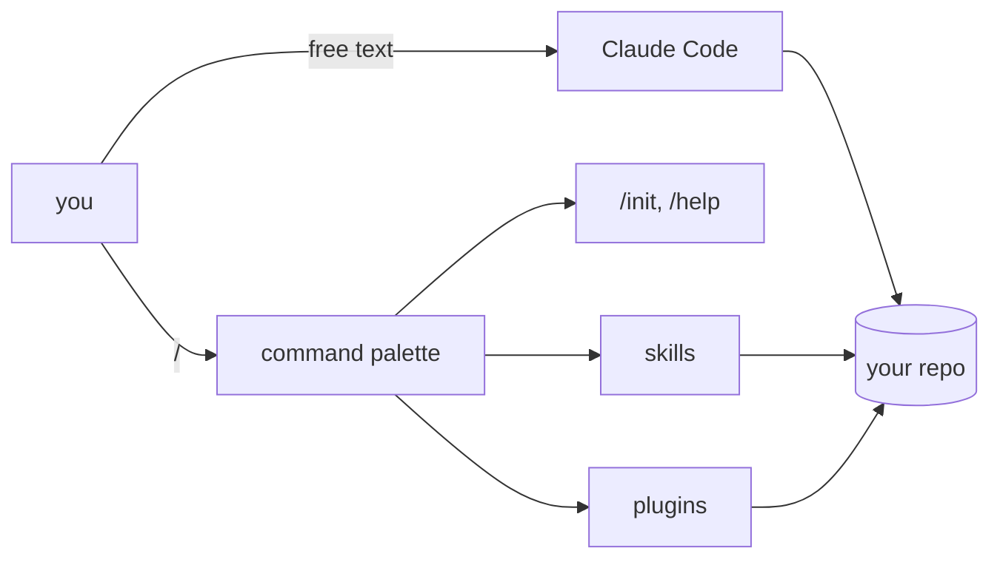

# Day 1: Install Claude Code and run your first slash command

Claude Code is not a chat window with a terminal attached. It is two products fused at the prompt: a conversation, and a command palette. Until you find the keystroke that surfaces the second product, nothing else in the tool makes sense.

## What we tried

We followed the install docs, ran `claude` inside a project, and typed a paragraph describing what we wanted. It answered. Then we stalled. There was no obvious way to ask it to run tests, open a file, or do anything beyond chat.

## What happened

A single keystroke fixed the mental model. Typing `/` opens the palette of everything Claude Code can do in this repo, right now: built-in commands, commands from installed plugins, and every skill you (or your team) have registered. It is the tool's on-ramp, its documentation, and its diff against the chat-in-a-browser experience all at once.

## How the pieces fit together

Everything in the right column touches the same working directory. That is why running `claude` from your home folder is almost always wrong: you get the tool, but not the context.

## What we learned

- Install from the official docs at <https://docs.claude.com/en/docs/claude-code>. The one-line installer is the supported path; everything else is a workaround.
- Start `claude` inside a project directory, never in `~`. Claude Code reads files relative to where you launched it, and your home folder is the one place you do not want it reading.
- Type `/` to see every command available in the current repo, including ones shipped by plugins and skills. `/help` is the one to memorise first.
- Your first real action is almost always `/init`. It scaffolds a `CLAUDE.md`, the single most important piece of configuration you will write in this tool. Day 2 covers it.

## Next

- **Day 2**. Your first `CLAUDE.md`.
