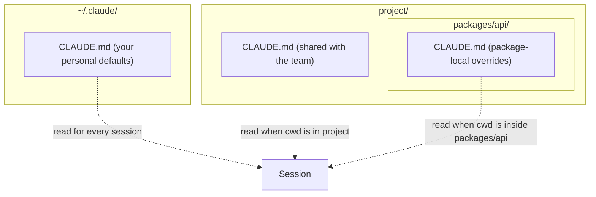

# Day 2: Your first CLAUDE.md

Without a `CLAUDE.md`, every session starts from zero. The model has to re-derive your conventions, package manager, folder layout, and definition of done on every task. A sixty-line `CLAUDE.md` is the cheapest thing you will ever write that pays compounding returns.

<WarStory title="We kept re-explaining the same repo">
For about a sprint and a half, we were pasting the same architecture notes into chat every morning. The answers were fine. The setup tax was not: three or four minutes of context-pasting before any work started, repeated across six engineers. We wrote one `CLAUDE.md`, deleted the sticky note of prompt fragments, and the drift stopped inside a day.
</WarStory>

## What we tried

We wrote a tiny `CLAUDE.md` with four sections and nothing else:

- Project purpose (two sentences)
- Tech stack and exact commands (`pnpm lint`, `pnpm test`, not "run linting")
- Coding conventions (naming, imports, where files live)
- Definition of done (tests green, types green, lint green, manual check for UI)

Then we asked Claude Code to open a known bug, propose a fix, and run the test suite.

## What happened

The first draft was not magical, it was consistent. Claude stopped guessing command names, picked the right package manager without prompting, and followed the folder structure the first time. The win was not quality; it was the absence of drift between sessions.

## Where CLAUDE.md lives

Personal defaults stay in your home folder. Team conventions live in the repo root. Package-local rules override both. Lower in the tree wins.

## What we learned

- Keep the root `CLAUDE.md` short enough that you are willing to read it every week. If it grows past one screen, something belongs in a sub-folder `CLAUDE.md`.
- Prefer concrete commands over prose. `pnpm test -- --run` beats "run the tests" because the model will copy it verbatim.
- Put "do not" rules in plain language. "Do not hand-edit generated files" saves a surprising amount of cleanup work.
- Treat the file as a living contract, not a one-time artifact. The best signal that yours is stale is the first time you catch yourself re-explaining something you already wrote down.

## Next

- **Day 3**. What lives in `~/.claude/` and why.
