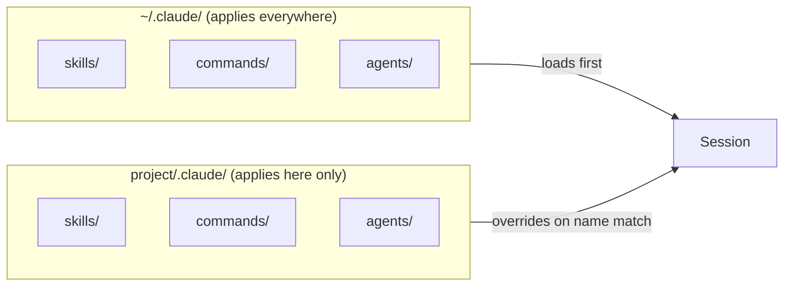

# Day 3: What lives in `~/.claude/` and why

The rule is simple and almost everyone discovers it the hard way: `~/.claude/` is for patterns you want everywhere, and `.claude/` in the repo is for patterns that only make sense in this project. Skipping the distinction is the root cause of nine in ten "why does this work in one repo and not the other" bug reports.

## What we tried

We mapped `~/.claude/` and compared it to a project-local `.claude/`, then ran the same `/review` command in two different repos to see which version of the skill Claude actually picked up.

## What happened

Global assets resolved exactly where we expected, but only once naming was consistent. A `review-pr` skill in `~/.claude/skills/` and another called `review-pr` in the project's `.claude/skills/` silently shadowed each other. Renaming the local one to `review-pr-frontend` made the intent obvious and the resolution predictable.

## What we learned

- **Repo-local beats global.** Opinionated, project-specific behaviour belongs in the repo's `.claude/`, where it ships with the code and shows up in code review.
- **Global is for leverage.** `~/.claude/skills/` is where your personal force-multipliers live: the QA skill you use on every project, the commit-format skill you refuse to give up.
- **Prefix by purpose.** `review-*`, `debug-*`, `release-*`, `ship-*`. The palette becomes searchable and you stop colliding on generic names like `check` or `verify`.
- **When behaviour feels random, check the scope.** Nine times in ten, something got installed globally that should have been local (or vice versa). `ls ~/.claude/skills` and `ls .claude/skills` usually solves it in thirty seconds.

## Next

- **Day 4**. Audit your E2E coverage.
