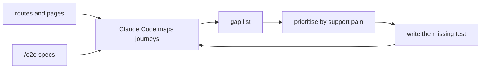

# Day 4: Audit your E2E coverage

If your E2E tests grew with the app, they almost certainly cover pages, not journeys. That distinction sounds academic until the most-broken flow in production has no test at all and your dashboard still reports 80%.

<WarStory title="80% coverage, zero tests for the #2 support ticket">
Eighty percent file coverage in our E2E suite. We were proud of the number. Then support flagged a spike in checkout abandons and we went looking for the test that should have caught it. There wasn't one. The flow existed in the app, it existed in the support queue, and it had never made it into the suite. We were measuring which files had test files attached, not which user journeys had tests that walked the whole path. The number was honest. It was just answering the wrong question.
</WarStory>

## What we tried

We asked Claude Code to do something we'd been postponing for a quarter: walk the repo and tell us what user journeys actually exist.

The prompt:

```
Read every route and page component in /src/app and /src/pages.
For each one, describe the primary user journey it participates in:
not the component name, but what the user is trying to accomplish.
Then read every file in /e2e and list which journeys have test
coverage and which don't. Output a gap list, not a coverage percentage.
```

Claude Code walked the file tree, read the route components, matched them against the test files, and produced something we hadn't had before: a journey map with coverage status next to each entry.

The output looked roughly like this:

```
User journeys found:
- Sign up (new user) ............. COVERED
- Sign in (returning user) ....... COVERED
- Browse catalog ................. COVERED
- Add to cart .................... COVERED
- Complete checkout .............. COVERED (steps 1-3 only)
- Abandon cart, return later ..... NO TEST
- Apply discount code ............ NO TEST
- Account settings update ........ COVERED
- Password reset ................. NO TEST
- Order confirmation email link .. NO TEST
```

Four uncovered journeys. The checkout test only covered the first three steps. Nothing confirmed the confirmation screen rendered, or that the order persisted past the redirect.

## How the audit loop runs



The loop is small enough to run in a single session. The work that takes time is acting on the gap list, not building it.

## What happened

The list was uncomfortable to read. We had a `checkout.spec.ts` that gave us confidence, but it stopped at "place order" without verifying what came after. That is the most common failure mode for an E2E suite: tests that walk into a flow but never confirm the exit.

Two things came out of the audit that we did not expect.

**The abandon-and-return flow was the #2 support ticket source.** We didn't know this until we put the gap list next to the support queue. Coverage gap and production pain were in the same place.

**Password reset was tested in unit tests but not E2E.** The unit test verified token generation. It did not test that the email link landed the user on the correct page with the form in the correct state. That's a different test.

Once we had the gap list, prioritisation was simple: sort by user impact and start from the top.

## What we learned

- Coverage by journey, not by file count. A file-level percentage will always look better than reality because it cannot see flows that span multiple files.
- Ask Claude Code to read your routes and map them to existing test files. Two minutes of prompting buys you the gap list you need to have a real conversation about testing priorities.
- A gap list beats a coverage percentage. "Four uncovered journeys, one is the #2 support ticket source" is a sentence your team can act on. "82% E2E coverage" is not.
- Tests that stop at the action without confirming the outcome are half-tests. A checkout test that doesn't verify the confirmation screen is a test for "the button didn't error", not "checkout works".
- Keep a coverage matrix in the repo, even a simple markdown table. When it lives next to the code, someone reads it during PR review. When it lives in a wiki, no one does.

## Next

- **Day 5**. Permissions and your first `settings.json`.
