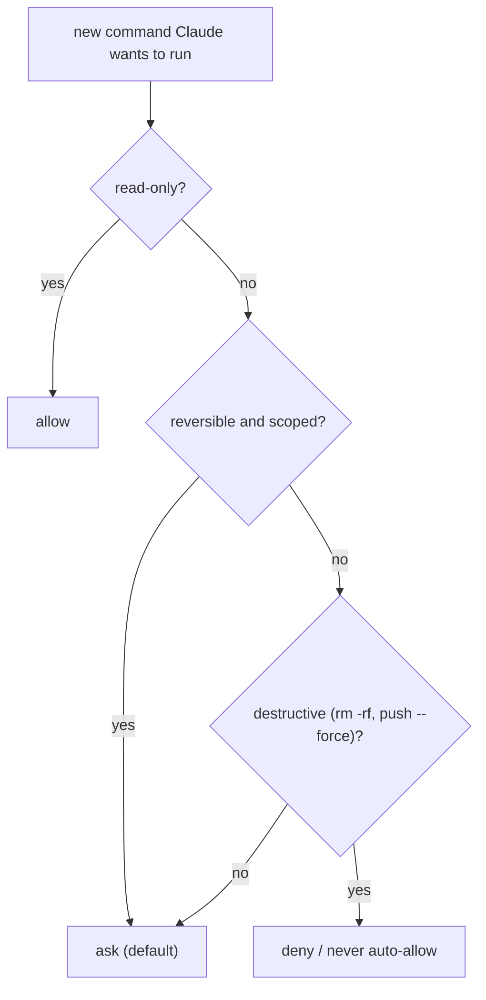

# Day 5: Permissions and your first settings.json

Every tool call Claude Code makes (a bash command, a file write, an MCP call) pauses and waits for approval. That is the right default. It is also death by a thousand interruptions if you never tune it.

<WarStory title="We approved npm run lint 40 times in one day">
Early on we were running long refactor sessions and letting Claude Code drive the loop: change, lint, typecheck, repeat. Every `npm run lint` and `git status` required a keypress. By the end of the day one of us had approved the same two commands more than forty times. We weren't reviewing anything. We were pressing Y out of habit. Pressing Y forty times isn't a safety control, it's a ritual that creates the illusion of one. The fix was a six-line `settings.json`.
</WarStory>

## What we tried

We created `.claude/settings.json` in the project root and added an allowlist for the commands we approved every time without thinking.

```json
{
  "permissions": {
    "allow": [
      "Bash(npm run lint)",
      "Bash(npm run build)",
      "Bash(npm run typecheck)",
      "Bash(git status)",
      "Bash(git diff*)",
      "Bash(git log*)"
    ]
  }
}
```

We also set up a global version at `~/.claude/settings.json` for commands that made sense across every project:

```json
{
  "permissions": {
    "allow": [
      "Bash(ls*)",
      "Bash(cat*)",
      "Bash(pwd)"
    ]
  }
}
```

The pattern for a rule is `ToolName(command-pattern)`. The wildcard (`*`) matches anything after the prefix. So `Bash(git log*)` allows `git log`, `git log --oneline`, `git log -p`, but not `git push`.

## Decide once: allow, ask, or deny



Most rules collapse to that tree. Read-only goes on the allowlist. Destructive stays gated forever. The middle band ("reversible and scoped") is the band you tune over time as you learn what your project actually does.

## What happened

The friction disappeared almost immediately for the commands we added. Claude Code moved through lint, typecheck, and fix cycles without pausing, which is exactly what you want when you're watching it work through a large change.

The unexpected part: removing the easy interruptions made it easier to notice the ones that remained. When Claude Code paused to ask, we paid attention, because it wasn't asking constantly anymore. The approval prompts that stayed were the ones doing real work.

We also discovered the project-level and global files merge. We'd been putting everything in project-level out of habit when several rules belonged globally. Splitting them halved the size of the project file.

## What we learned

- Separate read-only from write. Read-only commands (`git status`, `git diff`, `git log`, `ls`, `cat`) are almost always safe to allow. Write commands need judgment. Add them to the allowlist only after you've decided they're low-risk in this specific project.
- `settings.json` lives at `.claude/settings.json` for project rules and `~/.claude/settings.json` for global rules. Both files merge. Project rules take precedence on conflict.
- Never auto-allow destructive operations. `rm -rf`, `git reset --hard`, `git push --force`, deploy scripts: these stay in the ask column forever. The cost of a misfire is too high, and you're not approving these dozens of times per day anyway.
- If you want Claude Code to audit your own settings, use the `fewer-permission-prompts` skill. It reads your recent transcripts, finds the commands you approve most often, and proposes allowlist entries. A good bootstrap for a new project.
- Treat the allowlist as a living file. Add things when you notice you're approving them reflexively. Remove things if the project changes and a command becomes risky in a new context.

## Next

- **Day 6**. Using Claude Code with git.
