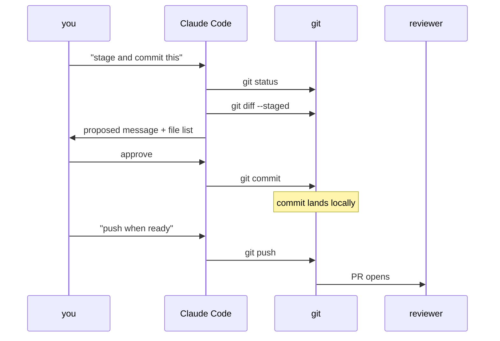

# Day 6: Using Claude Code with git

Claude Code can write code, run tests, stage files, and commit in one uninterrupted session. That is genuinely useful. It is also how you end up with `fix bug` in your main-branch history at 11:45pm on a Friday.

<WarStory title="fix bug">
A teammate was deep in a late-night debug session. Claude Code found the issue, made the fix, ran tests, staged, committed, pushed. The commit message was "fix bug". Three weeks later that commit landed in the middle of a production incident investigation. The diff was fine. The message told us nothing: not what broke, not what changed, not which system was affected. We added a commit-message format to `CLAUDE.md` the next morning and made "push requires explicit human instruction" a standing rule. Both should have been there on day one.
</WarStory>

## What we tried

We added a short git section to `CLAUDE.md`:

```markdown
## Git conventions

Branch naming: `feat/`, `fix/`, `chore/` prefix + short-description-in-kebab-case
Commit format: `type(scope): description`
  example: `fix(checkout): prevent double submit on slow connections`
Never commit without describing the specific change in the message.
Never push without explicit instruction from a human.
Never use --force or --no-verify flags.
Ask before staging files outside the scope of the current task.
```

Then we tested defaults: gave Claude Code a task, watched it complete the changes, and said "stage and commit this." With the conventions in place, it produced the right format. Without them, it wrote whatever seemed natural at generation time, sometimes good, sometimes "update files."

We also worked out which operations we delegate freely and which we always confirm:

**Delegate freely:**
- `git status`, `git diff`, `git diff --staged`, `git log --oneline`. All read-only.
- `git add <specific files>`. Staging by name after reviewing the diff.

**Always confirm:**
- `git commit`. We want to read the message.
- `git push`. Explicit human instruction every time.
- `git checkout -b`. We want to know what branch we're on.
- Anything with `--force`, `--hard`, or `--no-verify`.

## What a clean commit looks like



Note the two human gates: one before the commit, one before the push. Either gate alone is fine. Skipping both is how `fix bug` gets to main.

## What happened

The biggest shift was that Claude Code got much better at helping us review before committing. Once it knew our format, it staged the right files, proposed a message, and stopped. That pause turned the commit into a decision instead of an event that happened to us.

The thing we didn't expect: Claude Code is genuinely useful at the pre-commit step we'd been doing manually. We'd ask it to run `git diff --staged`, flag anything unintended, and summarise the change as a candidate message. A five-minute manual check became a thirty-second one.

The other surprise was scope creep in staging. Give Claude Code a large task and say "commit this" and it will sometimes stage side effects: a config update, a lockfile, a neighbouring component that got reformatted. Telling it explicitly which files to stage, or asking it to confirm the staged set first, prevents that.

## What we learned

- Specify branch and commit-message conventions in `CLAUDE.md`. Claude Code reads them at session start and applies them consistently. Without them, messages drift toward whatever seemed natural at the moment.
- "Never push without explicit instruction" is a standing rule. Pushing is hard to undo; it should always be a conscious decision. A session that ends with an automatic push is a session that moved faster than your intent.
- Delegate `git status`, `git add`, `git diff` freely; they're read-only or low-risk. Use `git diff --staged` before every commit, even small ones.
- Review staged files, not just the diff. Scope creep in staging is subtle: a reformatted file or an unrelated lockfile looks harmless until you're trying to cherry-pick the commit six months later.
- Never add `git push --force`, `git reset --hard`, or `git checkout -- .` to your allowlist. These destroy work and are nearly irreversible. The cost of a confirmation prompt is trivially low; the cost of a misfire is not.

## Next

- **Day 7**. Write your first skill from scratch.
