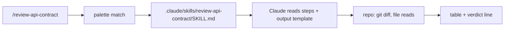

# Day 7: Write your first skill from scratch

A skill is a reusable operating procedure written in markdown. The value is consistency, not cleverness. The first skill you write should replace the prompt you keep retyping, not the one you wrote once and forgot.

## What we tried

We picked a task we did roughly twice a week: review API contract changes between branches and call out anything that would break consumers. The prompt for it had grown into a paragraph that lived in a Notion page nobody opened.

We turned it into a skill at `.claude/skills/review-api-contract/SKILL.md`:

```markdown
---
name: review-api-contract
description: Review API contract changes for breaking consumer impact
---

# Review API contract

## Inputs
- Base branch (default: main)
- Head branch (the change under review)

## Steps
1. Run `git diff <base>...<head> -- "**/openapi*.yaml" "**/schema*.ts"`.
2. For each changed endpoint, classify the change:
   - additive (new field, new endpoint, new optional param) -> safe
   - shape-change (renamed, removed, type changed) -> breaking
   - semantic-change (same shape, different behaviour) -> breaking
3. For every breaking item, list the consumers in `apps/*` that import the
   affected type or path.

## Output
| Endpoint | Change type | Breaking? | Consumers affected |
| -------- | ----------- | --------- | ------------------ |

End with a one-line verdict: SAFE TO MERGE / NEEDS CONSUMER UPDATES.
```

Three sections. Inputs, steps, output shape. Nothing more.

## How a skill resolves



The skill file is the contract. Claude follows the steps, the repo provides the data, the output template forces the shape. The user types one slash command and gets the same answer Tuesday and Friday.

## What happened

The first draft was too broad. It tried to cover OpenAPI files, GraphQL SDL, and TypeScript types in one pass and the output was a wall of prose. We narrowed it to one input shape (OpenAPI plus the TS schema we hand-write next to it) and one output (the table above). Once the scope was tight, it became reliably useful across three repos without changes.

The output template did most of the work. Claude Code is much better at filling in a table than at deciding what a good summary looks like. Pinning the columns pinned the answer.

## What we learned

- One skill, one job. If you can't name the job in five words, the skill is too broad.
- Constraints beat prose. A four-column output template produces tighter results than two paragraphs of "be thorough."
- Include an output template the reviewer can paste into the PR. The skill is only useful if its result lands somewhere; designing for that destination is half the work.
- Keep `SKILL.md` short enough that you'll re-read it when something feels off. A skill nobody re-reads is a skill that quietly drifts.

## Next

- **Day 8**. Autonomous browser QA with browser-use.
