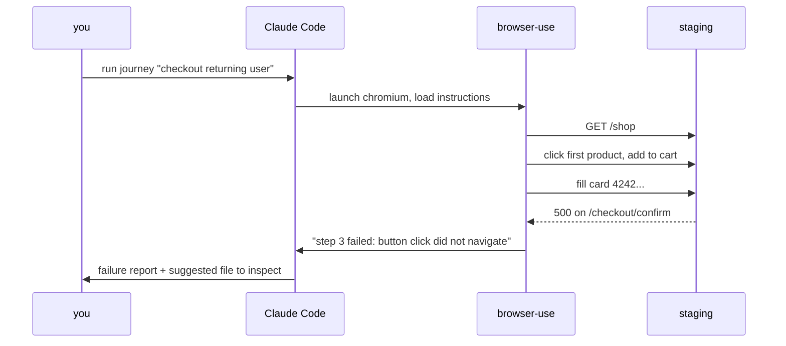

# Day 8: Autonomous browser QA with browser-use

Passing unit tests are not a working product. Browser QA is the layer that asks the question your test suite can't: does the thing work for a human looking at a screen.

<WarStory title="The button was there. It just didn't work.">
A CSS refactor passed every unit test and every API check. It also buried the checkout button under a transparent overlay with a higher z-index. Visually present, completely non-interactive. No automated test caught it because no automated test was looking at the rendered page. The first browser-use run found it in 90 seconds and told us, in a sentence, exactly where to look. We'd been about to ship.
</WarStory>

## What we tried

`browser-use` is a Python library that lets Claude Code drive a real browser: navigate, click, fill forms, read UI state, report what a human would experience. We set it up to verify our three highest-risk journeys after every significant UI change.

First, an isolated environment. `browser-use` needs Python 3.11+ and Playwright's browser binaries; you do not want either anywhere near your project's deps:

```bash
python3 -m venv .venv-qa
source .venv-qa/bin/activate
pip install browser-use playwright
playwright install chromium
```

Then a minimal instruction file. Not a test suite, just a plain-language description of the journey:

```
Check out as a returning user:
1. Go to /shop
2. Add the first product to cart
3. Proceed to checkout
4. Fill in the test card details (4242 4242 4242 4242, any future
   date, any CVC)
5. Confirm the order confirmation page loads
Report any step where the flow breaks or behaves unexpectedly.
```

We asked Claude Code to run that journey via browser-use against our staging URL. It navigated, clicked, filled fields, and returned a natural-language report. No assertion errors, no test framework boilerplate, just "step 3 failed: the checkout button is not responding to clicks."

## What a single run looks like



The output that lands in your terminal is the bottom line of that diagram: a sentence a non-engineer can read.

## What happened

The first surprise was how different the failure output felt. Instead of `AssertionError: expected 200, got 404`, we got a paragraph describing what a confused user would see. Triage was faster: no decoding a stack trace, just reading the report.

The second surprise was that browser-use found the z-index issue on its very first run, before we'd finished setting up the rest of the QA workflow. We'd been living with that bug for three days.

We also learned that full-site crawls are a mistake at this stage. The first time we pointed it at "verify the whole app", it ran for 20 minutes, produced a wall of output, and we couldn't prioritise any of it. Narrowing to two or three specific journeys made results immediately actionable.

## What we learned

- Browser-use is for journey verification, not unit testing. It answers "does the UI work for a human", which Playwright assertions and API tests cannot.
- Start with two or three highest-risk flows, not a full-site crawl. Broad scope produces noise that buries real failures.
- Set up a Python virtualenv before the first run. browser-use needs a clean environment with its own Playwright binaries, kept separate from your app deps.
- The output is natural-language failure notes, not assertion errors. That is a feature, not a limitation: easier to triage, easier to share with non-engineers, easier to file as a bug ticket.

## Going deeper

This cable is the entry point. The standalone cable [**Autonomous browser QA with browser-use**](/cables/claude-code/browser-use-qa) covers the full setup: skill packaging, screenshot capture on failure, seed data, and running browser-use on a schedule. Read that when you're ready to turn this from a one-off check into a repeatable part of your release process.

## Next

- **Day 9**. Your first subagent.
