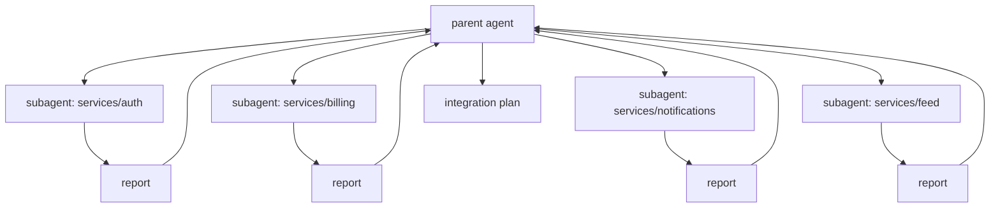

# Day 9: Your first subagent

A subagent is not a clever trick for parallelism. It is a way to keep the parent's context clean while a narrowly-scoped task runs in its own. The right use case is bounded, parallelisable, and has a specific artifact you want back.

## What we tried

We had a refactor that touched four modules. Done in one session, the parent's context filled up with file reads from every module and cross-talk between concerns. We split the work: a narrow `module-reviewer` subagent inspected one module at a time and returned a short report; the parent agent collected the reports and handled integration.

The subagent definition lived at `.claude/agents/module-reviewer.md` and was deliberately small:

```markdown
---
name: module-reviewer
description: Inspect one module for breaking changes and side effects
---

You review a single module. You do not change code outside it.
You return:
- list of public exports that changed signature
- list of imports that newly fail
- one-paragraph risk note
```

The parent then dispatched four subagents in parallel, one per module, each with explicit ownership: `services/auth`, `services/billing`, `services/notifications`, `services/feed`. Each came back with a focused report. The parent merged them into the integration plan.

## Parent and subagent topology



The parent never reads the source files in those four directories itself. It reads four short reports.

## What happened

Two things changed. First, the parent stayed sharp: its context held the integration plan, not four modules of source code. Second, the merge step became the easy part of the job. Each subagent had returned the same shape (signatures, imports, risk note), so the parent was reconciling tables, not re-reading code.

When we tried this with a vaguer brief ("review the codebase for issues"), it failed. The subagents wandered, returned overlapping observations, and the parent ended up doing the work twice. Boundaries were the whole game.

## What we learned

- Delegate only well-scoped tasks. "Review this module and report on these three things" works. "Look at the codebase" does not.
- Assign explicit file ownership for each subagent. Overlapping ownership produces overlapping reports and contention you have to untangle by hand.
- Keep the integration path in the parent. Subagents do not know about each other; merging their output is the parent's job and should never be delegated.
- Pin the output shape in the subagent definition. If every report comes back as the same table or the same three bullets, the parent's job is reconciliation, which is fast.

## Next

- **Day 10**. Your first slash command.
