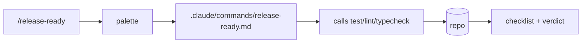

# Day 10: Your first slash command

A slash command is the fastest way to package a routine you run every week. It is not a place for reasoning; it is a place for the steps you already trust, named so the rest of the team can find them.

## What we tried

We built `/release-ready`, a command that walked the same five gates we ran before every Friday deploy. The gates already lived in a Notion checklist. The checklist was the problem: it was always slightly out of date, and three of us each ran it slightly differently.

The command lived at `.claude/commands/release-ready.md`:

```markdown
---
description: Run the five release-readiness gates
---

Run these five checks in order. Stop and report on the first failure.

1. Tests: `pnpm test --run`. All green.
2. Types: `pnpm typecheck`. No errors.
3. Lint: `pnpm lint`. No errors.
4. Migrations: list any pending migrations in `db/migrations/`.
5. Changelog: confirm the top entry in `CHANGELOG.md` matches the
   version in `package.json`.

Output a markdown checklist with PASS / FAIL / SKIPPED for each.
End with a one-line verdict: READY TO RELEASE or BLOCKED.
```

Five steps, one output shape, one decision at the end.

## Slash command, skill, code



The command file is the routine. Slash commands run steps; skills are for procedures with judgment. If the routine ever has to ask "is this safe to do", it has outgrown a slash command and wants to be a skill.

## What happened

Two things shifted. The checklist stopped drifting because the command was the checklist; updating one updated the other. And release prep stopped feeling like a vibe check, because the verdict line at the end is binary. Either every gate was green or one wasn't, and the failing one had a name.

A surprise: people on the team started running `/release-ready` mid-feature, not just on release day. The cost of running it had dropped to one keystroke, and an early warning that a migration was pending was useful in the same way a smoke alarm is useful before the fire.

## What we learned

- Use slash commands for routines, not deep reasoning. If the steps require judgment, you want a skill instead.
- Keep the output structured and checklist-shaped. A list with PASS/FAIL is easier to scan than a paragraph that says "things look fine."
- Version the command when the process changes. Treat the command file like any other code: PR'd, reviewed, attributed.
- Put the routine where the team will find it. `.claude/commands/` ships with the repo, which means a new contributor sees `/release-ready` in the palette on day one. A Notion page gets bookmarked once and never read.

## Next

- **Day 11**. Reproduce, fix, verify.
