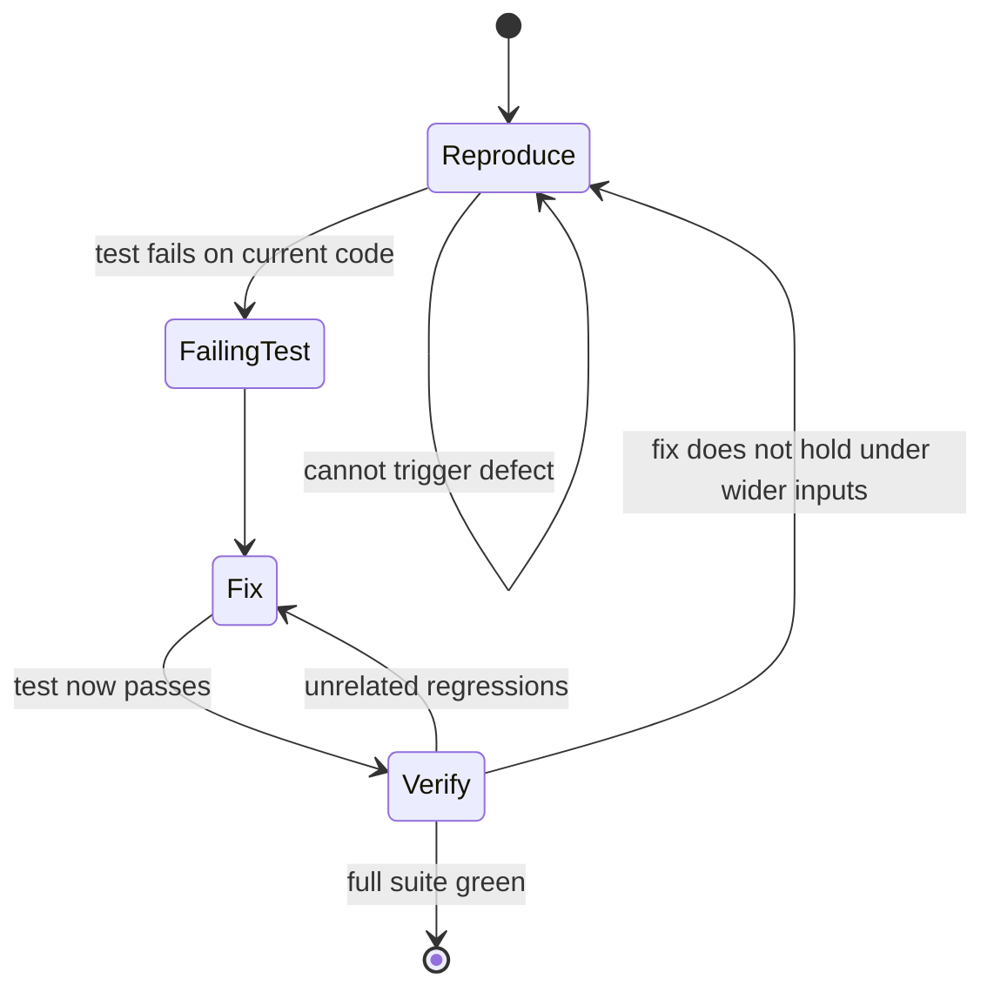

# Day 11: Reproduce, fix, verify

Asking Claude Code to "fix this bug" without first reproducing it is the fastest way to close a ticket that reopens three days later. The fix will look plausible, the symptom will disappear, and the real defect will still be sitting there waiting for production traffic.

<WarStory title="We fixed the wrong bug">
We reported a login timeout to Claude Code and asked it to fix it. It made a plausible change (bumped a session expiry constant) and the symptom we had seen in manual testing went away. We shipped it. Forty-eight hours later the bug was back, worse than before. The real cause was a race condition that only appeared under load. Claude Code had never seen it. Neither had we. If we had started with a reproduction script that hit the actual failure path, the race condition would have been visible on the first run.
</WarStory>

## What we tried

We now treat every bug prompt as a three-phase contract:

1. **Reproduce.** Write a failing test or script that proves the bug exists, repeatably and automatically. Not optional. If you cannot reproduce it, you cannot know when you have fixed it.
2. **Fix.** Apply the smallest change that makes the reproduction pass. Nothing more. Scope creep during a bugfix is how new bugs get introduced.
3. **Verify.** Run the full test suite, not only the new reproduction. A fix that breaks something else is not a fix.

The change that made it stick was in how we prompt. Instead of:

```
Fix the login timeout bug in auth/session.ts
```

we write:

```
There is a login timeout bug. Before making any changes:
1. Write a test in auth/session.test.ts that reliably reproduces the failure
2. Confirm the test fails on the current code
3. Then fix only what makes that test pass
4. Then run the full auth test suite and report results
```

The extra instruction costs about thirty seconds to write. It has prevented at least four incomplete fixes in the last two months.

## The loop as a state machine



The arrow from Verify back to Reproduce is the one most teams forget. If the fix holds on the reproduction but breaks on slightly wider inputs, the reproduction was too narrow. Tighten it and go again.

## What happened

The first time we applied the loop strictly, Claude Code's reproduction test revealed something we had not seen: the bug only fired when two conditions were true at once, a stale token AND a specific network timeout. Our original bug report mentioned only the symptom. The reproduction test exposed both.

The fix took four lines. The verification pass caught one unrelated test that was already broken and that we had been ignoring. We fixed it in a separate commit.

The PR looked different from our usual bugfix PRs. It had a new test, a small targeted change, and a clean test run. Reviewers approved it in ten minutes because the evidence was already assembled.

## What we learned

- Never say "fix this bug". Say "first write a test that reproduces this bug, then fix it." Claude Code follows the loop reliably when the phases are explicit.
- A failing test is the specification. The fix is just the work of turning it green. That framing keeps the scope honest.
- Verify means running the full suite, not only the reproduction. Regressions hide in the tests you did not look at.
- The three-phase pattern produces a PR with built-in evidence: the reproduction test, the targeted fix, the clean run. Reviewers see the full story without asking questions.

## Going deeper

The standalone cable [**Reproduce → fix → verify**](/cables/claude-code/reproduce-fix-verify) covers the full pattern, including how to handle bugs with external dependencies, rollback notes for high-risk fixes, and how we wire this loop into a Linear workflow.

## Next

- **Day 12**. When your CLAUDE.md starts to drift.
