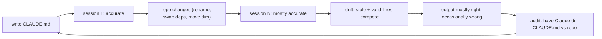

# Day 12: When your CLAUDE.md starts to drift

A `CLAUDE.md` that no longer matches the repo is worse than no `CLAUDE.md` at all. Stale context does not merely fail to help. It actively misdirects, and the cost is silent.

<WarStory title="Six months of silent misdirection">
Six months after writing our original CLAUDE.md, we noticed Claude Code was still recommending a package manager we had replaced and suggesting cleanup scripts for a database we had migrated away from. The file had grown to 300 lines. Nobody had touched it since the initial setup. The failures were subtle: output mostly right, wrong in ways that took real debugging time to spot. We had been paying the drift tax for weeks before the pattern clicked.
</WarStory>

## What we tried

Every `CLAUDE.md` grows. A 60-line project contract that was accurate on day one turns into 300 lines of mixed signal by month six: old run commands, removed dependencies, renamed directories, workflows that no longer exist. Claude Code reads all of it every session. Every stale line competes with the accurate ones for attention.

We ran a drift audit. The prompt:

```
Read CLAUDE.md and check every command, path, package name, and
workflow reference against what is actually in this repo. List
anything that looks outdated, removed, or no longer accurate.
```

It found eleven issues in a 280-line file. Nobody had run a deliberate review in four months.

## How drift sneaks in



The loop only closes when someone runs the audit. Until then, drift compounds quietly.

The categories we found most often:

- **Removed packages** still referenced in setup steps.
- **Run commands** for scripts that had been renamed or deleted.
- **Directory paths** for folders that had been reorganised.
- **Workflow descriptions** for processes that no longer matched how the team actually worked.
- **Database and infrastructure references** from an old stack that no longer existed.

We deleted aggressively. When in doubt about a line, we removed it. You can always add guidance back. You cannot un-confuse a session that started with contradictory context.

## What happened

The file shrank from 280 lines to 94. Nothing the team actually relied on was lost. Most of the deleted content was context that had been accurate once and silently stopped being accurate. Nobody had deleted it because nobody was certain it was wrong. It just never came up until something broke.

After the audit, Claude Code's suggestions felt clearly cleaner. The "mostly right but occasionally wrong" pattern stopped. The cost we had been paying turned out to be larger than we had estimated.

A secondary signal: sections of `CLAUDE.md` that nobody on the team could explain confidently were the sections most likely to be stale. If a rule exists and nobody can articulate why, it either predates current knowledge or predates the current codebase. Either way, it deserves scrutiny.

## What we learned

- Drift signal: Claude Code starts recommending commands or patterns you have not used in months. That is the file talking, not the model hallucinating.
- Ask Claude Code itself to audit `CLAUDE.md`. "What in this file no longer matches the repo?" is a two-minute prompt that catches things human reviewers miss.
- One rule per line is easier to delete than paragraphs. Dense prose makes drift invisible because the outdated part blends into the valid part.
- Date-stamp major `CLAUDE.md` rewrites with a comment at the top. Any section that predates a major dependency upgrade or infrastructure migration is a candidate for review.

## Next

- **Day 13**. CLAUDE.md split patterns.
