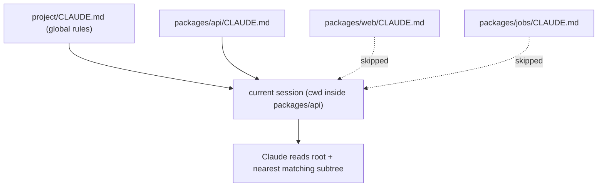

# Day 13: CLAUDE.md patterns: when to split

One `CLAUDE.md` works until the project's complexity exceeds a single file's clarity budget. The symptom is not size; it is that edits in one section start breaking rules in another. When that happens, the fix is not a longer file. It is a smaller one, with children.

## What we tried

We kept the root `CLAUDE.md` for rules that apply everywhere (commit format, definition of done, package manager, global "do nots") and pushed domain-specific guidance down to folder-local files. Claude Code reads a local `CLAUDE.md` whenever the working directory sits inside that subtree, so the rules travel with the code they describe.

```
project/
├── CLAUDE.md             (global: stack, commands, DoD)
├── packages/
│   ├── api/
│   │   └── CLAUDE.md     (routes, migrations, auth conventions)
│   ├── web/
│   │   └── CLAUDE.md     (routing, design tokens, form patterns)
│   └── jobs/
│       └── CLAUDE.md     (queue names, idempotency rules)
```

## How the files compose



Lower-in-the-tree rules win on conflict. Only the `CLAUDE.md` files on the path from your current directory up to the repo root are loaded, so each session sees the minimum context it needs.

## What happened

Two things improved quickly. Sessions that ran inside `packages/api` stopped getting distracted by frontend conventions, and sessions inside `packages/web` stopped trying to apply API-layer idioms to React components. The root file shrank from 240 lines to about 80 because domain-specific material had a better home.

The other shift was social. Edits to the `packages/api/CLAUDE.md` file got reviewed by the API owner, not by whoever happened to be doing the root rewrite. Contributor diff quality followed.

## What we learned

- Keep global rules global: stack, commands, definition of done, commit format, "do not" list. Everything else is a candidate to move.
- Split when two conditions co-occur: the root file crosses about 150 lines, and unrelated edits are stepping on each other in review.
- Add a one-line table of contents at the top of the root, listing which subfolders have their own `CLAUDE.md`. Navigation stays obvious.
- Treat `CLAUDE.md` ownership like code ownership. The person closest to the code should own the nearest file.

## Next

- **Day 14**. Plugins worth installing.
