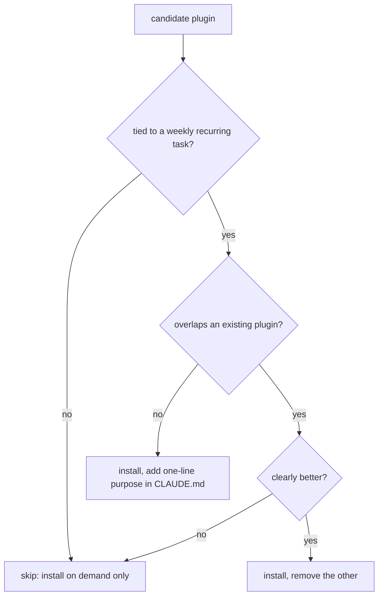

# Day 14: Plugins worth installing

Most plugin bloat comes from installing tools before defining workflows. A crowded command palette is not capability. It is a tax on every new teammate who has to guess which of forty commands is the one they actually want.

## What we tried

We froze new installs for a week, audited what was already there, and wrote down which recurring task each plugin was supposed to support. Anything without a clear answer came out. What was left collapsed into four classes:

- **Repo and PR operations.** Branch creation, PR summaries, review triage.
- **Issue tracker integration.** Pulling tickets, posting updates back.
- **Observability lookup.** Errors, traces, cost dashboards tied to the code we are editing.
- **Deployment status checks.** Build state, preview URL, rollback history.

## How we decide before installing

The one-line purpose is the commitment. If nobody can say why the plugin is installed, nobody defends it when it starts producing noise.

## What happened

Palette noise dropped sharply. The plugins that stayed had higher usage per person, because each one mapped to a task somebody runs every week. When a plugin fell out of use, it was visible quickly: nobody defended it when we cleaned up again two sprints later.

## What we learned

- Install only plugins tied to a weekly workflow. Occasional-use tools belong on the install-when-you-need-it list, not in the palette.
- Sunset anything unused after two sprints. The cost of a zombie plugin is not disk space; it is the attention of every engineer who scans the palette looking for the one they want.
- Document the purpose of each installed plugin in the team `CLAUDE.md`. One line, written by the person who advocated for it. That line is the reason they get to keep it.

## Next

- **Day 15**. Writing a war story: the contributor guide.
