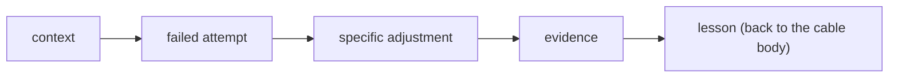

# Day 15: Writing a war story

Cables earn trust by describing what actually happened, including the part where things did not work. A war story is not a polished retrospective; it is the paragraph that makes the rest of the cable load-bearing. If your cable has no war story, a reader has to take your advice on faith. If it has one, the advice arrives with receipts.

## What we standardise

Every war story in this repo carries four beats, in order. Nothing more.

1. **Context under real constraints.** A real project, a real deadline, a real reason the shortcut seemed tempting. Not a tutorial setting.
2. **One failed attempt.** What we actually tried first. The version of the solution that looked right and was not.
3. **One specific adjustment.** The edit that changed the outcome. Usually small, usually unglamorous.
4. **Evidence.** A measurable result, or a clear qualitative shift a reader can verify. No vibes.

## The shape on the page

The war story is not the cable. It is the gear that makes the cable turn. The body of the cable is where the lesson lives; the war story is why you should believe the lesson.

## What happened when we held the line

Contributions got easier to review. Reviewers stopped asking "is this accurate?" and started asking "is this reusable?", which is the question that produces better writing. Readers stopped encountering cables that felt like recycled tutorial advice, because recycled advice tends to fail the evidence beat first.

We also rejected more drafts. That turned out to be the point. A war-story standard is a forcing function: if you cannot name the failed attempt or the specific adjustment, the insight is not yet clear enough to publish.

## What we learned

- Lead with a concrete moment. "We did X on Tuesday" beats a definition every time.
- Tie every claim to evidence the reader can verify: a log line, a PR, a measurable shift. "Felt faster" is not evidence.
- Prefer honest tradeoffs over polished narratives. Cables where something had to be sacrificed are more useful than cables where everything worked.
- Keep the war story short. Four beats, one screen. Anything longer belongs in the cable body.

## Next

- Founder-track cables (`team-setup`, `leverage-patterns`) pick up from here: how we rolled Claude Code out to a 6-person team, where subagents buy real leverage, and how to keep `CLAUDE.md` a team contract.
