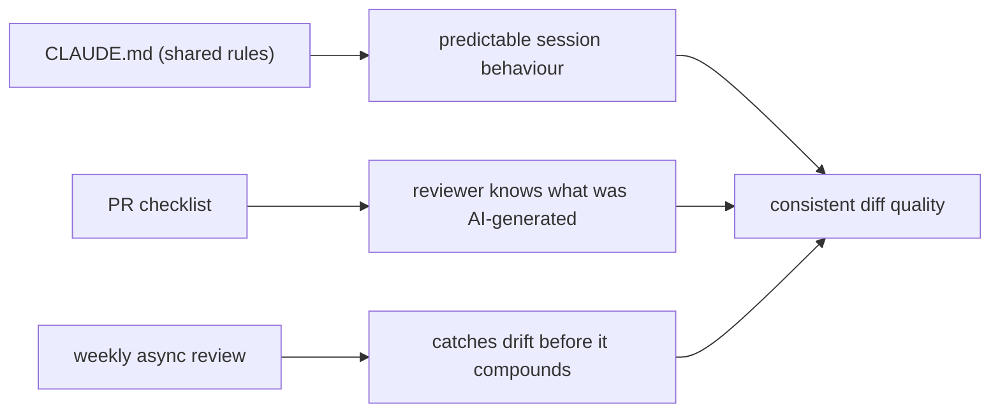

# F1: How we rolled Claude Code out to a 6-person team

The hardest part of a team rollout was not the tooling. It was the quiet drift toward six slightly different workflows sharing one repo.

<WarStory title="Six workflows, one repo, zero shared defaults">
Three engineers used Claude Code daily. Three used it occasionally. The three daily users had each built their own prompt habits: different ways to ask for tests, different branch naming, different approaches to commit messages. On code review, the diff quality told you who wrote the PR before you checked the author. That is the opposite of what shared tooling should do.
</WarStory>

## What we tried

We standardised three layers, nothing more:

1. **One shared root `CLAUDE.md`.** Stack, commands, definition of done, commit format, "do not" list.
2. **One PR checklist for AI-assisted changes.** A four-line template pasted into every PR description: what was generated, what was human-reviewed, what tests were added, what was explicitly rejected.
3. **One weekly review loop.** A thirty-minute async ritual where the team posted one prompt that worked and one that missed, with the diff.

## The layers, and what each one prevents

Remove any one of the three and the other two start slipping. The contract stops mattering if the checklist is not enforced, and the checklist stops mattering if nobody is reviewing the patterns that produce it.

## What happened

Adoption stabilised quickly because expectations were explicit. New teammates onboarded faster because the workflow was documented and enforced. PR review time dropped because reviewers could predict code shape before reading the diff. The weekly review ran well for about six weeks, then drifted when the person running it changed roles. We rebuilt it as an async ritual, which held.

## What we learned

- Team rollout is a process-design problem first, a tooling problem second.
- Shared conventions beat individual prompt craftsmanship. A good personal prompt that nobody else uses is not a team asset.
- Weekly review loops prevent silent drift. The ritual survives only if it is async and cheap; a thirty-minute synchronous meeting will not last a quarter.

## Result

Week-one output variance dropped quickly. The clearest signal was PR review time: reviewers could predict code shape before reading the diff. New hires referenced the `CLAUDE.md` instead of asking questions we had answered before. The weekly review loop held for six weeks, drifted, and held again once we made it async. The honest version of this story is that rollout is not a one-time event. It is a small, recurring practice you keep in rotation.
