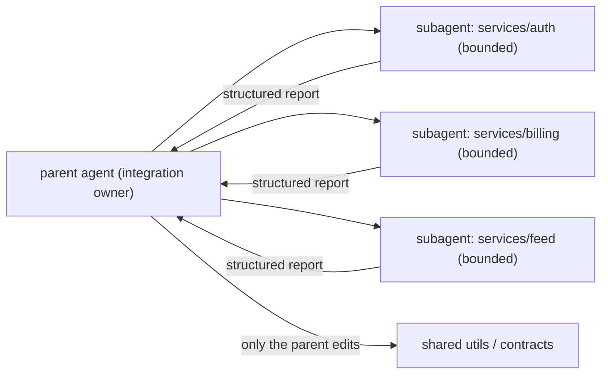

# F2: 5x output without 5x tokens

Subagents did not speed us up until we redesigned the boundaries of the work itself. Parallelism without ownership does not compound; it collides. The leverage came from task design, not from spawning more agents.

<WarStory title="Parallelism without ownership created rework">
We ran three subagents on the same feature: one wrote to a shared utility file, a second rewrote the same function in a different direction, and a third assumed a signature nobody had finalised. Merging took longer than building the feature from scratch would have. The problem was not parallelism. It was overlapping ownership. Three agents with the same "make this better" brief produced three incompatible answers, and a parent whose job became conflict resolution rather than integration.
</WarStory>

## What we tried

We stopped spawning subagents and started scoping tasks. For every piece of work we now ask three questions before delegation:

1. **Is the input well-defined?** Exact files, exact branches, exact context.
2. **Is the output shape fixed?** A table, a list, a diff, a report. Not prose.
3. **Is the file boundary clean?** Nobody else is writing here.

If any answer is "roughly" or "mostly", the task is not ready to delegate. Tighten it first.

## Where the leverage actually lives

The parent keeps two jobs that must not be delegated: edits to anything shared, and the integration step. Everything else flows in from the edges, in a shape the parent can reconcile in minutes.

## What happened

Cycle time dropped and review quality went up because each delegated output arrived with a clear acceptance shape. Reviewers stopped asking "what did this one do?" and started asking "does this match the contract?". That is a faster question.

The less obvious win was on tickets. Once we scoped every task before delegating, our ticket quality improved across the board, including the work humans were doing. A habit the subagents forced us into made the team sharper in places subagents never touched.

## What we learned

- Delegate bounded work, not ambiguous work. If you cannot describe the output in a sentence, the task is not ready.
- Assign one integration owner. The parent agent edits shared code; subagents do not.
- Measure leverage by lead time and rework rate, not by how many agents ran in parallel. Spawning more agents is easy; the hard part is keeping their outputs compatible.

## Result

Lead time on feature branches dropped from roughly three days to under one for bounded tasks. The rework rate moved from about one in three delegated tasks needing major revision to about one in eight. The change was not about subagents per se; it was about taking "scope before delegate" seriously enough to make it a rule. Once we did, the tool got noticeably more useful.
