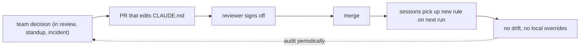

# F3: CLAUDE.md as team contract

Once more than one person relies on `CLAUDE.md`, it stops being notes and starts being a contract. Treat it as personal scratchpad and you get three engineers effectively working under three different rulebooks. Treat it as code, with versioning, review, and ownership, and the file becomes the cheapest alignment tool on the team.

<WarStory title="Local edits broke shared expectations">
One engineer quietly edited their local `CLAUDE.md` to skip a linting step they found noisy. A second engineer, onboarding that week, followed the committed version and got confused when the first engineer's PRs kept arriving without the expected lint output. A third opened a PR that CI rejected for a policy that existed only in one person's local file. We found out at standup, not in review. Three people, three different effective contracts, one shared repo.
</WarStory>

## What we tried

We stopped tolerating divergent local copies. `CLAUDE.md` (and every child `CLAUDE.md`) moved into the PR review cycle. No silent edits, no local overrides, no "I'll commit this later". The rules became:

- **Versioned.** Changes ship in PRs and are attributed like any other code.
- **Reviewed.** At least one reviewer signs off on the diff, same as a code change.
- **Owned.** Each file has an owner listed in CODEOWNERS. The owner is the person a reviewer pings when a rule feels wrong.

## How the contract stays a contract

The loop only works if updating `CLAUDE.md` is treated as part of finishing the decision, not as documentation to write later. Skipping that step is how drift starts.

## What happened

Volume of "how do we handle X" messages in Slack dropped quickly, from several per week to about one or two per sprint. PR approvals got faster because reviewers could point to a line in the contract instead of re-litigating style in the comments. New engineers stopped needing a buddy to interpret the repo; the file did that work.

## What we learned

- `CLAUDE.md` should be reviewed, versioned, and owned like any production artifact.
- Keep policy explicit: what to do, what not to do, and why. The "why" is the part that survives contact with new contributors.
- A living contract beats a long static handbook. The file is useful precisely because it stays current.

## Result

The Slack volume drop was the headline. The quieter win was review quality: comments shifted from style nits to actual design questions, because the style decisions had already been made and were linkable. The cost is real discipline: the file has to be updated when decisions change, and that is easy to skip under deadline pressure. We have let it fall two or three sprints behind reality before someone flagged it. The contract only works if the team treats updating it as part of finishing a decision.
