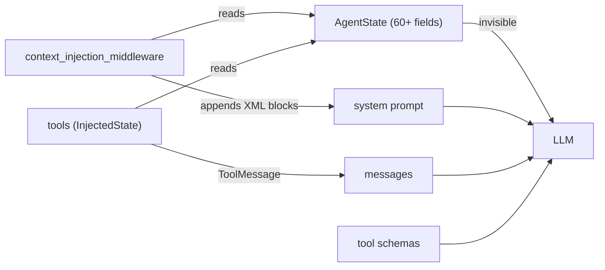

# Your LLM cannot read your agent state

The most common architectural mistake when building LangGraph agents is assuming the LLM can see your state fields. It cannot. The LLM only sees three things: the messages list, the system prompt, and the tool schemas. Everything else you store in `AgentState` is invisible to the model. Unless you explicitly inject it, the model is reasoning from the transcript alone, no matter how much structured state you think you are handing it.

<WarStory title="The agent kept asking for context it already had">
We built an onboarding flow that collected a user's business name, primary goal, success metric, and design preferences into a `job_context` state field. We stored the values in `AgentState` across the session. Users complained the agent kept asking clarifying questions it should already know the answer to: "What is the main goal of this project?" coming back two or three turns into a session. We opened the LangSmith traces and saw the agent had the correct values in state while generating those questions anyway. The model was not reading our state. It was making decisions from messages alone. We had built careful state management that the LLM was entirely bypassing.
</WarStory>

## What we tried

Our initial AgentState had 65+ fields covering everything from `main_goal` to `job_context` to `design_document` to `plan_items`. We assumed the framework would make these accessible to the LLM. The LangGraph docs cover `InjectedState` for tools, but we missed the implication: that injection is for tool *execution* code, not for the LLM's reasoning.

We tried adding instructions to the system prompt like "Read the current goal from state" and "Use the job_context you were given." These had no effect. There was nothing for the model to read. We also tried putting state field names in tool descriptions, hoping the model would call a tool to retrieve them. That just added unnecessary tool calls to every turn.

## How state actually reaches the model



The LLM only reads the three right-side inputs. Every path from `AgentState` to the model has to pass through one of them, or the model cannot see the data.

## What happened

The fix required rethinking how state flows to the model. We built a `context_injection_middleware` that runs before every model call and appends state values as XML-tagged blocks to the system prompt:

```python
def build_goal_context_injection(state: dict) -> str | None:
    main_goal = state.get("main_goal")
    job_context = state.get("job_context")

    if not main_goal and not job_context:
        return None

    parts = ['<goal_context priority="HIGH">']
    parts.append("## CURRENT GOAL & BUSINESS CONTEXT")

    if main_goal:
        parts.append(f"\n**Main Goal:** {main_goal}")

    if job_context and isinstance(job_context, dict):
        biz = job_context.get("businessName")
        if biz:
            parts.append(f"**Business:** {biz}")
        # ...additional fields...

    parts.append("</goal_context>")
    return "\n".join(parts)
```

This middleware appends to `request.system_prompt` before the model call, handling both `str` and `list` prompt formats. The system prompt references `<goal_context>` tags explicitly, so the model knows where to look. Once deployed, the repeated clarifying questions stopped immediately. The model was now reasoning from the same state the code was managing.

The same pattern handles design requirements, cancellation context (when a user stops a task mid-execution), and model-specific behavior reminders. Each injection is wrapped in semantic XML tags, gated behind a feature flag, and wrapped in try/except so failures are logged but never crash the workflow.

## What we learned

- **The LLM only sees messages, system prompt, and tool schemas.** State fields in `AgentState` do not reach the model unless you explicitly bridge them.
- **Middleware injection is the correct bridge.** Running before every model call, it keeps the system prompt up to date with current state without requiring changes to tools or graph structure.
- **XML tags create durable contracts.** The system prompt references `<goal_context>` and `<design_requirements>` by tag name. The model reliably locates the injected content and the structure is stable across prompt iterations.
- **Tools can also bridge state via results.** Tools that use `InjectedState` can read state programmatically and return relevant values as `ToolMessage` content. This works for on-demand lookups; middleware injection works for persistent context that should be available every turn.
- **State update allowlists prevent drift.** We discovered that tools returning `state_updates` in their results needed explicit allowlisting in `ALLOWED_STATE_UPDATE_FIELDS` or updates were silently dropped by the after-model middleware. Missing a field from this set caused hard-to-debug state corruption where the model believed it had updated state and acted accordingly, but nothing was persisted.

## When this doesn't fit

- **Simple single-turn agents.** If your agent has no persistent state across turns, this is irrelevant. The conversation history is the only context you need.
- **Very large state objects.** Injecting everything every turn inflates tokens and can damage prompt caching. Be selective: inject only what the model needs to reason correctly in the current turn, not your entire state schema.
- **Agents using tool-based retrieval as the primary pattern.** If your architecture has the model explicitly call a `get_context` tool, middleware injection can create redundancy. Pick one pattern and document it.

## Result

Once middleware injection was in place for `main_goal`, `job_context`, and `design_requirements`, the repeated clarifying questions dropped to near zero. Users stopped seeing the agent ask for information it had already collected during onboarding. A harder-to-measure improvement: the model's plan quality increased because it was reasoning from complete business context rather than inferring from conversation history alone. The caveat is that every injected field adds tokens to every model call. We iterated on what to inject versus what to retrieve on-demand, eventually disabling design injection after moving it to a memory bootstrap that runs only once per session.
