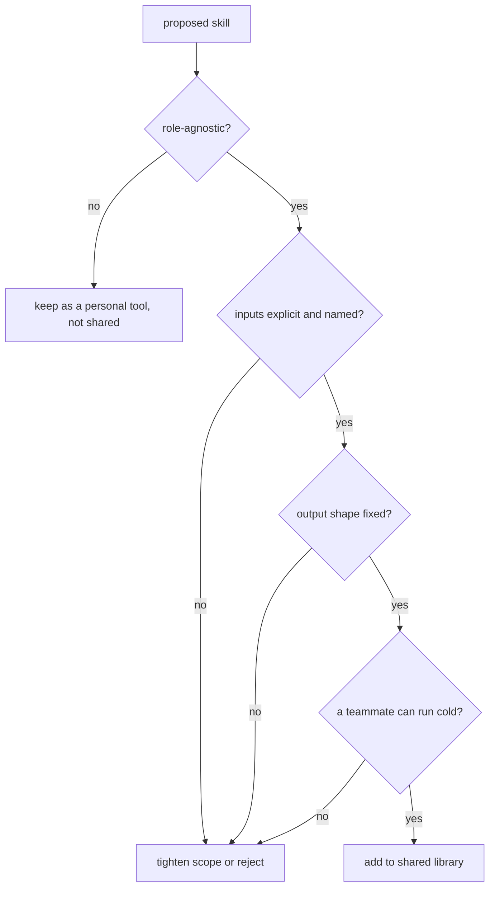

# F4: Skills that scale past solo usage

A skill that works only for its author is not a skill; it is a shell alias with extra steps. Most skills fail at team scale because they assume context the author forgot to write down. Fixing that takes a sharper brief, not a longer one.

<WarStory title="Skills built for one person got ignored by everyone else">
We had eleven skills in the shared library. Three of us were using the same two regularly; the other nine were barely touched. When we asked why, the answer was consistent: the unused skills assumed context that was not obvious. A specific file layout. A variable that had to be set before running. An output format that only made sense if you had written the skill yourself. One engineer said it felt like running someone else's shell alias. The skills were not bad. They were written for a reader who did not exist: the author.
</WarStory>

## What we tried

We deleted most of the library and kept only skills that passed four tests:

1. **Role-agnostic.** Works for any engineer on the team, not only the person who wrote it.
2. **Input-explicit.** States what it needs, in what shape, up front. No implicit file structure.
3. **Output-structured.** Produces the same shape every time (table, diff, checklist). No free-form paragraphs.
4. **Testable in review.** A teammate can read the output and tell you whether the skill ran correctly, without looking at the code.

## The bar before adding a new skill

The "run cold" question is the one that catches the subtle failures. If a teammate has to ask what a variable means or where a file lives, the skill is not ready.

## What happened

Reuse went up and onboarding sped up because every teammate could run the same skill and get comparable results. The library got smaller and more valuable in the same step.

## What we learned

- Skills should encode team standards, not personal style. If the brief includes "the way I usually do this", it is not a shared skill yet.
- Structured outputs make downstream review faster. A table you can scan beats a paragraph you have to interpret.
- Prune aggressively. One high-quality skill is better than five vague ones. The library is a palette, not a museum.

## Result

We went from eleven skills to five. Usage on the remaining five moved from sporadic to near-daily across the team. The two most-used skills were the most narrowly scoped: one that generated typed API response handlers from an OpenAPI schema, and one that wrote test stubs from a function signature. The broader "write a component" and "refactor this module" skills kept getting ignored. Too much assumed context, too little specified input. The honest lesson is that skills which feel powerful when you write them often feel ambiguous to everyone else. The bar we now use before adding anything: can a teammate run it cold, with no explanation, and get a result they would commit?
