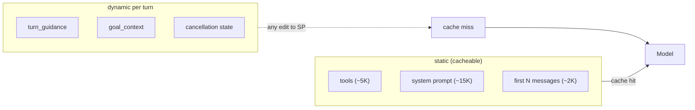

# Prompt caching kills dynamic injection. Pick one

Building a production LangGraph agent requires middleware that injects dynamic content into the system prompt every turn. Prompt caching requires that the system prompt stay static between turns. These two requirements are directly in conflict, and most teams discover the tension only after building both systems independently.

## The conflict, in one picture



Any write to the system prompt invalidates the cache for that turn. The only question is which injections are worth paying for.

<WarStory title="We shipped turn guidance that cost more than it saved">
We built middleware that detected when an agent was making consecutive single `write_file` calls instead of batching them in parallel. When detected, it injected a `<turn_guidance>` block into the system prompt coaching the model to batch operations. It worked. The anti-parallel behaviour dropped measurably in testing. We shipped it to production, and our Anthropic cache hit rate fell from 90%+ to under 40%. Every turn where guidance was injected was a cache miss. The model's token usage doubled on those turns. We were spending more on correcting suboptimal behaviour than the suboptimal behaviour itself was costing us. We disabled the guidance injection and accepted the anti-parallel pattern rather than pay the cache penalty.
</WarStory>

## What we tried

Our agent system prompt is ~15,000 tokens covering tools, workflow phases, and behavioral rules. At $15 per million input tokens, a production agent running hundreds of sessions per day makes caching essential, not optional. We had implemented prompt caching with two cache breakpoints: one after the tools list (~5K tokens) and one after the system prompt (~15K tokens). With `MESSAGE_CACHE_COUNT=2`, we cached the first two messages as well, achieving ~90-95% cache hit rates in steady-state sessions.

In parallel, we had built a rich middleware pipeline with dynamic guidance injection: turn limit warnings at turns 10, 15, and 20; parallel execution coaching when consecutive single-write patterns were detected; a hard-limit force-close message at turn 20. Each of these modified `request.system_prompt` before the model call. Modifying the system prompt at any point invalidates the cache for that turn.

We also tried injecting dynamic content as a `HumanMessage` appended to the messages list instead of into the system prompt, hoping to preserve the system prompt cache while still getting guidance to the model. This worked for some patterns but not others. Gemini models echoed injected guidance text verbatim into their responses, treating it as content to parrot rather than instructions to internalise.

## What happened

We had to make an explicit architectural choice and document it in the middleware file itself. The turn guidance middleware is not registered in agent.py. The comment in `turn_guidance.py` reads:

```python
# CACHE OPTIMIZATION: Turn guidance injection is DISABLED to maintain 90%+ cache rate
# With MESSAGE_CACHE_COUNT=2, we achieve optimal caching by keeping system_prompt static
#
# Previously, we injected guidance into system_prompt, which invalidated the cache
# With this change:
# - Breakpoint 1: Tools (~5K tokens) - 100% cached
# - Breakpoint 2: System prompt (~15K tokens) - 100% cached (never modified)
# - Breakpoint 3: First 2 messages (~2K tokens) - 100% cached (fixed position)
#
# Total cache rate: ~90-95%
#
# Trade-off: Turn guidance (wrap_up warnings, force_close) is disabled
# The agent relies on context window management (summarization) instead
```

The code remains complete, tested, and dormant, intentionally kept for re-enablement if cost structures change or the caching infrastructure migrates to a tier where cache misses are cheaper. The logic for detecting consecutive single writes, counting run-scoped turns, and building guidance text is all production-quality. It just does not run.

The dynamic injections that stayed (goal context, cancellation state, Gemini communication reminders) survived because they were necessary for correct behaviour and the cost of the cache miss was justified. We validated each one against a single question: "Does removing this cause observable behavioural regressions?" Goal context: yes, agent asks redundant questions. Cancellation context: yes, agent repeats cancelled work. Turn guidance: no measurable regression that exceeded the caching cost.

For the parallel-execution problem specifically, we solved it differently: explicit parallel-execution examples in the static system prompt, plus a few-shot XML example baked into the static prompt for first-message turns. Static content, cached normally.

## What we learned

- **Every dynamic system prompt modification is a cache miss.** The math is straightforward: if your system prompt costs $X to process uncached and your cache hit rate is 90%, the effective cost per turn is $0.1X. Injecting dynamic content on 30% of turns converts those turns to full-price, reducing effective cache rate to ~70%.
- **Classify each injection as correctness-critical or quality-improving.** Correctness-critical injections (goal context, cancellation state) survive the cache miss. Quality-improving injections (turn guidance, parallel nudges) must justify their cost against alternatives.
- **Static prompt, dynamic alternatives.** Turn guidance became a few-shot example in the static system prompt. Design requirements moved from per-turn injection to a memory bootstrap that runs once per session. The behavioral outcome was similar; the token cost was not.
- **Model-specific injection behaviour is a separate constraint.** Gemini models echo injected guidance verbatim when it appears in `HumanMessage` content. That forced all behavioural guidance into the system prompt (cache-hostile) or made it purely directive without examples (less effective). The intersection of "must be in system prompt" and "must be static" is a tight constraint to design within.
- **Keep disabled middleware in the codebase.** The commented-out guidance injection is explicitly preserved for re-enablement. Cost structures change, caching tiers improve, and model behavior changes. Code that represents a conscious tradeoff decision belongs in the repo with the reasoning intact.

## When this doesn't fit

- **Agents where correctness always wins over cost.** If every dynamic injection is truly necessary for correct behaviour, accept the cache miss. Incorrect agent behaviour is more expensive than cache misses.
- **Low-traffic internal tools.** If you're running hundreds of turns per day rather than hundreds of thousands, caching optimization may not move the needle. Profile before optimizing.
- **Non-Anthropic models.** Prompt caching is an Anthropic-specific feature. Google Gemini has context caching with different mechanics and pricing. OpenRouter routes to multiple backends with different caching behaviors. The same tradeoff exists but the math differs.

## Result

After disabling turn guidance injection and keeping only correctness-critical injections, our steady-state cache hit rate returned to 90-95% on Anthropic model turns. The parallel-execution anti-pattern we were trying to correct with dynamic guidance persisted at roughly the same rate as before (about 15-20% of multi-file operations were still written sequentially instead of batched). The token cost of that inefficiency was lower than the token cost of cache-busting every affected turn. We monitor the parallel-execution rate in LangSmith production traces and plan to revisit the dynamic guidance if the inefficiency rate increases substantially or if caching costs drop.
