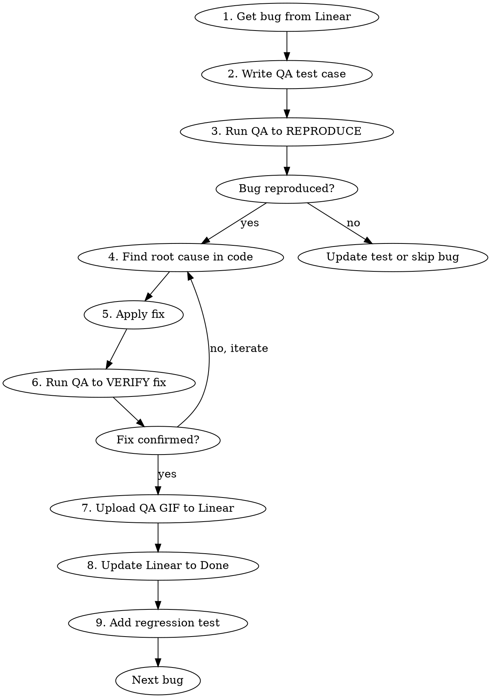

# Bug Fix Cycle

Fix bugs from Linear using a strict reproduce-fix-verify cycle with the QA agent.

**Iron rule:** Never fix a bug you haven't reproduced first. Never claim a fix works without QA verification.

## Workflow Per Bug



## Authentication & Personas

Most bugs require authenticated sessions. The QA agent auto-refreshes expired tokens before each run.

**Persona selection for test cases:**
- `unauthenticated`. Public pages only (home, pricing, login, signup)
- `free-user`. Most bugs (builder, chat, message counter, suggestions, file upload)
- `pro-user`. Pro-tier features (billing, advanced limits, priority support)

**How it works:**
- Credentials stored in `apps/qa-agent/.env` (`QA_FREE_USER_EMAIL`, `QA_FREE_USER_PASSWORD`, etc.)
- On each `python cli.py run`, expired tokens auto-refresh via Supabase Auth API
- Persona files: `apps/qa-agent/personas/{free-user,pro-user}.json`
- Cookies injected into browser via Chrome DevTools Protocol before test starts

**Manual refresh (if auto-refresh fails):**
```bash
cd apps/qa-agent && source .venv/bin/activate
python cli.py auth --persona free-user --email qa-free@juliet.app --password 'QaTest-2026_Free'
python cli.py auth --persona pro-user --email qa-pro@juliet.app --password 'QaTest-2026_Pro'
```

**Default: use `free-user` unless the bug specifically involves unauthenticated pages or pro-tier features.**

## Step 1: Get Bug Details from Linear

```
mcp__claude_ai_Linear__get_issue(id: "NOR-XXX")
```

Extract: title, steps to reproduce, expected behavior, evidence links.

## Step 2: Write QA Test Case

Save to `apps/qa-agent/tests/regression/<nor-xxx-short-name>.md`:

```markdown
# NOR-XXX: [Bug title as test name]

- **persona**: free-user
- **priority**: critical | high | medium | low
- **tags**: regression, nor-xxx

## Steps

[Steps from Linear issue, adapted for QA agent]

## Expected

[What SHOULD happen - the bug means this currently FAILS]

## Notes

Reproducing NOR-XXX: [brief description]
```

## Step 3: Run QA to Reproduce

```bash
cd apps/qa-agent && source .venv/bin/activate
python cli.py run --file tests/regression/<test-file>.md
```

- If QA agent confirms the bug: proceed to fix
- If QA agent can't reproduce: check test case, try different approach, or mark as "Cannot Reproduce" in Linear

## Step 4: Find Root Cause

Use Explore subagent or Grep to find the code causing the issue. Understand WHY it fails before changing anything.

## Step 5: Apply Fix

Make the minimal code change. Run type checks:
```bash
cd apps/juliet-v2 && npx tsc --noEmit
cd apps/api-server && npx tsc --noEmit  # if api-server changed
```

## Step 6: Run QA to Verify Fix

Re-run the SAME test case:
```bash
cd apps/qa-agent && source .venv/bin/activate
python cli.py run --file tests/regression/<test-file>.md
```

- If QA passes: fix is confirmed
- If QA fails: iterate on the fix

## Step 7: Upload QA GIFs to Linear

Upload **both** the reproduction (before fix) and verification (after fix) GIF recordings to Linear.

1. Find the GIFs in the QA report directories:
   ```
   # Before fix (from Step 3 reproduction run):
   apps/qa-agent/reports/<reproduce-run-id>/gifs/<test-id>.gif
   # After fix (from Step 6 verification run):
   apps/qa-agent/reports/<verify-run-id>/gifs/<test-id>.gif
   ```

2. Upload both GIFs to Supabase storage:
   ```bash
   SUPABASE_URL="<from apps/juliet-v2/.env>"
   SUPABASE_KEY="<SUPABASE_SERVICE_ROLE_KEY from apps/juliet-v2/.env>"
   # Before fix
   curl -X POST "${SUPABASE_URL}/storage/v1/object/project-images/qa-evidence/<nor-xxx>-reproduction.gif" \
     -H "Authorization: Bearer ${SUPABASE_KEY}" \
     -H "Content-Type: image/gif" \
     -H "x-upsert: true" \
     --data-binary "@<before-gif-path>"
   # After fix
   curl -X POST "${SUPABASE_URL}/storage/v1/object/project-images/qa-evidence/<nor-xxx>-verification.gif" \
     -H "Authorization: Bearer ${SUPABASE_KEY}" \
     -H "Content-Type: image/gif" \
     -H "x-upsert: true" \
     --data-binary "@<after-gif-path>"
   ```

3. Embed both in Linear issue description and attach as links:
   ```markdown
   ### QA Bug Reproduction (Before Fix)
   
   ### QA Verification (After Fix)
   
   ```
   Also attach both via `links` parameter in `save_issue`.

## Step 8: Update Linear

```
mcp__claude_ai_Linear__save_issue(id: "NOR-XXX", state: "Done", description: "...")
```

Include: root cause, fix applied, QA verification result, and GIF evidence path/link.

## Step 9: Add Regression Test

If no existing e2e test covers this bug, add one to `apps/juliet-v2/e2e/tests/`. The QA agent test case stays in `apps/qa-agent/tests/regression/` as well.

## Batch Mode

When fixing multiple bugs:
1. Prioritize by severity: Urgent > High > Medium > Low
2. Fix one at a time through the full cycle
3. After all fixes, run full smoke + regression suite:
```bash
python cli.py run --suite smoke
python cli.py run --suite regression
```
4. Store affected modules for final comprehensive test

## Red Flags - STOP

- Fixing code without reproducing first
- Claiming "fixed" without QA verification
- Skipping the QA agent and only running Playwright
- Batching fixes without per-bug verification
